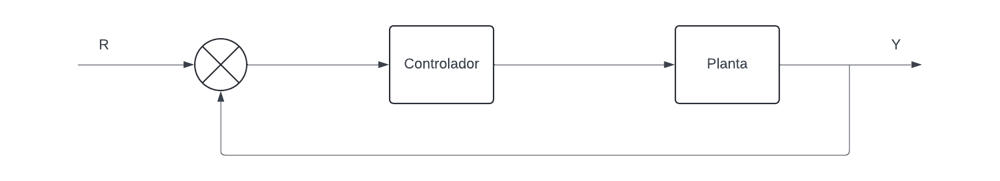
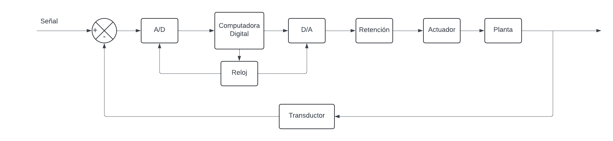
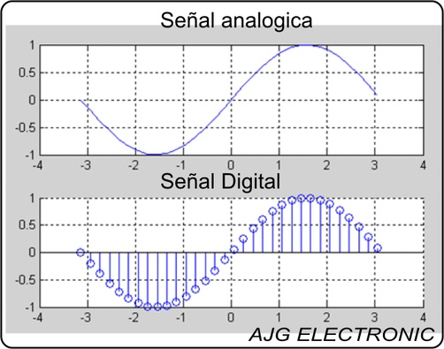

<h1 align="center"> Control Digital </h1>

Es una tecnología poderosa que permite automatizar y optimizar el funcionamiento de diversos sistemas. Su capacidad para procesar información de manera rápida y precisa lo convierte en una herramienta indispensable en la industria moderna.

## 1. Señales Digitales vs. Señales Analógicas

>Señal Digital: Tiene solo dos posibles valores o estados, representados generalmente con una onda cuadrada. 
>Señal Analógica: Continua y puede tomar cualquier valor dentro de un rango determinado en el dominio del tiempo.

Las señales digitales son fundamentales en los sistemas de control digital debido a su robustez y capacidad para ser procesadas por sistemas computacionales, a diferencia de las señales analógicas, que, aunque más precisas, son más susceptibles a interferencias.

### Estructura de un controlador analogico

Figura 1. Controlador analogo

### Estructura de un controlador digital

Figura 2. Controlador digital

## 2. Conversión Análoga a Digital (A/D)

 Figura 3. Señal analoga y digital

Es el proceso de transformar una señal continua y variable en el tiempo (analógica) en una secuencia de valores discretos (digitales). Esto se logra mediante tres etapas principales: muestreo, cuantización y codificación

>**Muestreo:** Medición periódica del voltaje de una señal analógica, cuya frecuencia se mide en Hz. 
>**Cuantización:** Conversión de las muestras a una serie de valores correspondientes a cada medida tomada  
>**Codificación:** Asignación de valores binarios a los valores cuantizados, se debe definir el numero de bits que se desea utilizar.

## 3. Conversión Digital a Análoga (D/A)

Es el proceso inverso a la conversión analógica a digital. Consiste en transformar una señal digital, representada por una secuencia de números binarios (ceros y unos), en una señal analógica continua. Esto se logra mediante un conversor digital-analógico (CDA), el cual asigna a cada valor digital un nivel de tensión o corriente específico. A continuación, se generan muestras de la señal analógica utilizando estos niveles, y mediante técnicas de interpolación se obtiene una señal analógica continua. 

### Metodos de conversión:

 - **Resistores ponderados:** Es más sencillo pero menos preciso, las formulas que se usan son las siguientes:
    
    $$E_o =−Rf(\frac{Va}{R} + (\frac{Vb}{2R}) + (\frac{Vc}{4R})$$
    $$E_o = \frac{R_f E_r}{R}$$
    $$V_o = - \left(X_1 \frac{R}{2R} +X_2 \frac{R}{4R} +X_3 \frac{R}{8R} + X_4\frac{R}{16R} \right)*E$$

 - **Red escalera R-2R:** Es más complejo, pero ofrece mayor precisión, las formulas que se usan son las siguientes:
  $$V_o = -\left(\frac{R_f}{R}\right)\left(\frac{V_0}{16} + \frac{V_1}{8} + \frac{V_2}{4} + \frac{V_3}{2}\right)$$

$$V_o = -\left(\frac{R_f V_{ref}}{R}\right)\left(\frac{B_0}{16} + \frac{B_1}{8} + \frac{B_2}{4} + \frac{B_3}{2}\right)$$

>

>